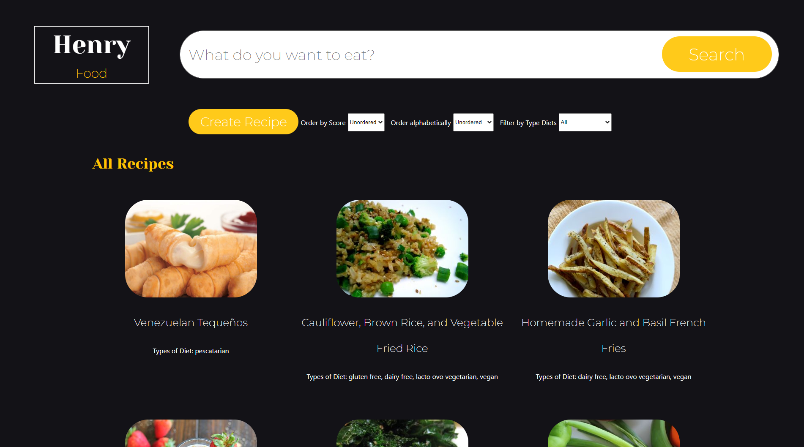
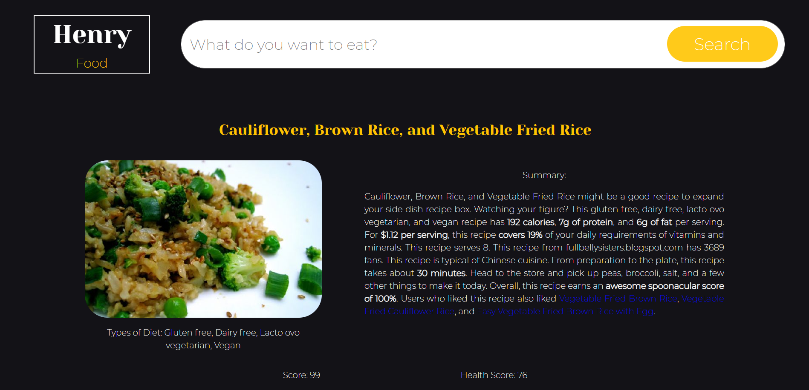

# Individual Project - Food App

 

## Statement

The Henry Food App was developed during the [Henry](https://www.soyhenry.com/) Bootcamp. The idea was to create an App where you get different food recipes along with relevant information about them using an external api: [spoonacular](https://spoonacular.com/food-api), and from that, among other things:

  - Search recipes
  - Filter them / Sort them
  - Create our own new recipes

#### Project Objectives

- Building an App using React, Redux, Node and Sequelize.
- Learn and practice the GIT workflow.

## Technologies used:
- Node.js
- React
- Redux
- Express
- Sequelize - Postgres
- Express.js
- CSS with no external libraries

 
 

#### Installation and Setup Instructions
1. Installation: `npm install` on both the api and the client folders.

2. Remember to create and setup the file `api/.env` to run the Back-End correctly. You will need your Postgres credentials, create a new DB on your computer and also get an ApiKey from [Spoonacular](https://spoonacular.com/food-api).

2. In both the api and the client directory, you can run: `npm start`.

    This will run the app in the development mode.\
Open [http://localhost:3000](http://localhost:3000) to view it in the browser.